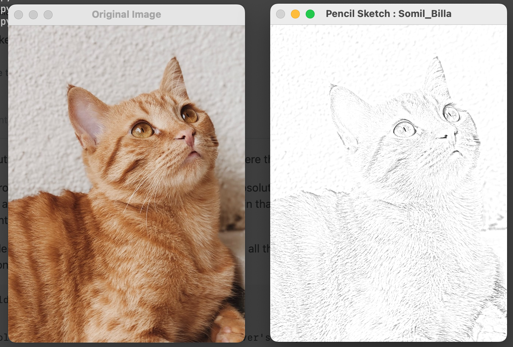

# Sketch-u-Python

Python program using openCV which creates a pencil sketch of any given image

## Pre-requisites

This project is built using open-CV library which can be installed using the command.
<br>

```
pip install opencv-python
```

## How it Works

1. first we convert the image from RGB - GreyScale.

```
gray_image = cv2.cvtColor(image, cv2.COLOR_BGR2GRAY)
```

2. Then the greyscale image is inverted from greyScale and then blurred using Gaussian Blur.

```
inverted_image = 255 - gray_image
blurred = cv2.GaussianBlur(inverted_image, (21, 21), 0)
inverted_blurred = 255 - blurred
pencil_sketch = cv2.divide(gray_image, inverted_blurred, scale=256.0)
```

## Make it run

- clone and navigate to the repo
- install the pre-requisites
- change the image to your desired image.
- `python new.py`

> Do change the name of the image <br>
> And patienty wait for some time. (This aint C++ bruh..)

<br>


